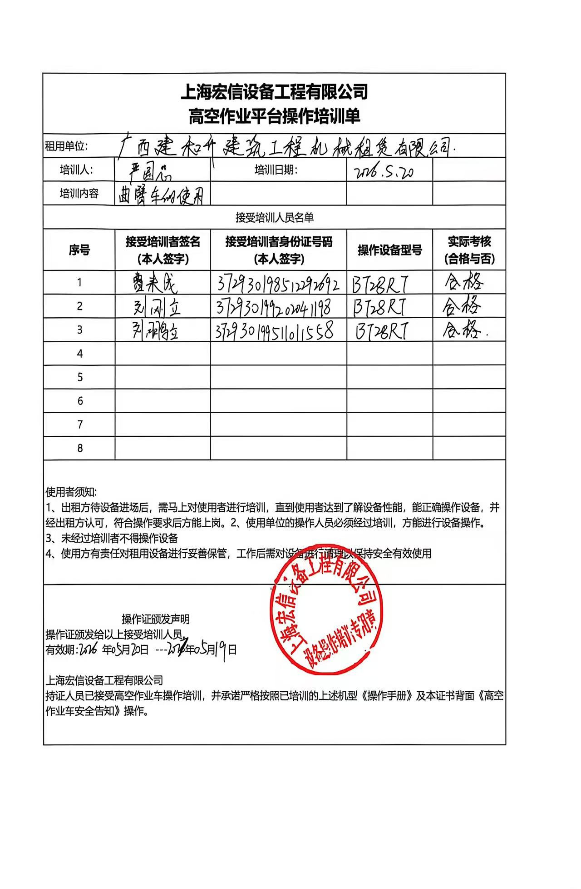

<!DOCTYPE html>
<html lang="zh-CN">
<head>
    <meta charset="UTF-8">
    <meta name="viewport" content="width=device-width, initial-scale=1.0">
    <title>操作证办证记录查询</title>
    
</head>
<body>
    
操作证办证记录

    <!-- 用户信息卡片 -->
    

        
        

            
<strong>曹来成</strong>

            
371728200403192710

            
广西建和升建筑工程机械租赁有限公司

        

    

    <!-- 证件信息列表 -->
    

        

            培训日期
            2026-05-20
        

        

            操作证有效期
            2027-05-19
        

        

            操作证编号
            No.GKPX2026051901877
        

        

            操作机型
            电动臂车
        

    

    <!-- 签字照片区域 -->
    

        <h3>签字照片——操作培训单签字照片</h3>
        
    

</body>
</html>
